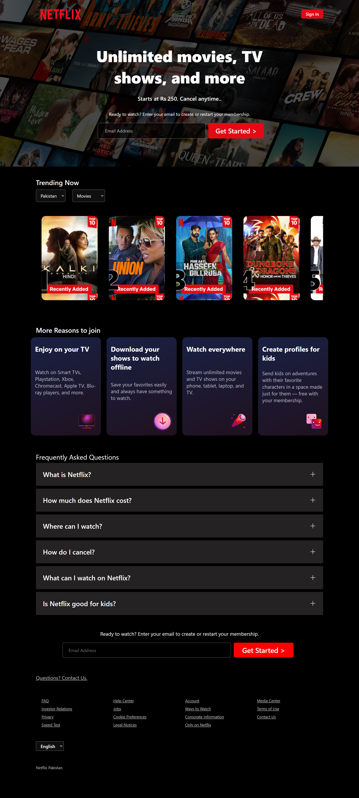

# Netflix Clone



## Table of Contents
- [Introduction](#introduction)
- [Features](#features)
- [Technologies Used](#technologies-used)
- [Installation](#installation)
- [Usage](#usage)
- [Project Structure](#project-structure)
- [Contributing](#contributing)
- [License](#license)
- [Contact](#contact)

## Introduction
This project is a clone of the Netflix homepage, built using only HTML and CSS. The aim of this project is to replicate the design and layout of Netflix's user interface as closely as possible using just HTML and CSS.

## Features
- **Responsive Design**: The layout adjusts to different screen sizes using media queries.
- **Flexbox Layout**: Utilizes flexbox properties for layout management.
- **Section-Specific Styling**: Different sections like "Reasons" and "FAQ" have their own specific styles.
- **Interactive Elements**: Includes a form for entering an email address and a button to get started Image caraousels styled with purely CSS3 to view trending movies, FAQs mockup and much more

## Technologies Used
- **HTML5**: For structuring the content.
- **CSS3**: For styling the content.

## Installation
To get a local copy up and running, follow these simple steps:

1. **Clone the repository**:
    ```sh
    git clone https://github.com/AliHamza71451055/Netflix-Clone-using-just-HTML-and-CSS.git
    ```
2. **Navigate to the project directory**:
    ```sh
    cd Netflix-Clone-using-just-HTML-and-CSS
    ```
3. **Open the `index.html` file in your browser**:
    ```sh
    open index.html
    ```

## Usage
Open the `index.html` file in any web browser to view the Netflix Clone homepage. You can also use a local development server to serve the files.

## Project Structure

Netflix-Clone-using-just-HTML-and-CSS/
├── index.html
├── style.css
└── README.md


## Contributing
Contributions are what make the open-source community such an amazing place to learn, inspire, and create. Any contributions you make are **greatly appreciated**.

1. Fork the Project
2. Create your Feature Branch (`git checkout -b feature/AmazingFeature`)
3. Commit your Changes (`git commit -m 'Add some AmazingFeature'`)
4. Push to the Branch (`git push origin feature/AmazingFeature`)
5. Open a [Pull Request]

## License
Distributed under the MIT License. See `LICENSE` for more information.

## Contact
Ali Hamza - alihamza71451055@gmail.com

Project Link: [https://github.com/AliHamza71451055/Netflix-Clone-using-just-HTML-and-CSS](https://github.com/AliHamza71451055/Netflix-Clone-using-just-HTML-and-CSS)

